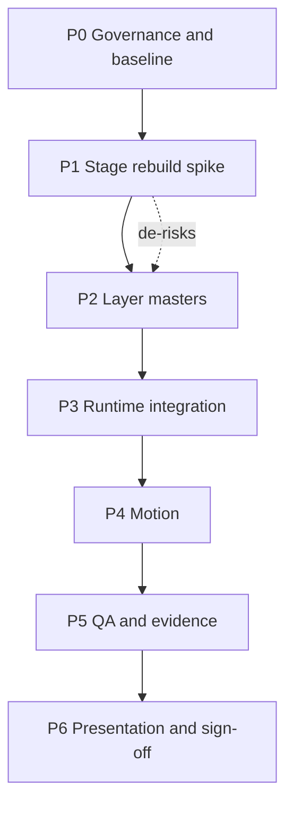

# Mcello — Döner Builder Blueprint V1

Status: **P0 done. P1 done — the stage is stacked, the clip mask and the opaque inner-bread block are gone, and the full atomic browser suite is green. P2 done: all twelve layer masters exist and are landed, `npm run check` is 406 pass / 0 fail over 21 ingredient directories. P3 is next.**

Binding decision: [[DECISIONS]] `D076`, scoped against `D075`, `D074`, `D071`, `D070`, `D068`, `D065`.
Acceptance rows: [[ACCEPTANCE]] · Evidence: [[V1_EVIDENCE]] · Asset provenance: [[ATOMIC_INGREDIENT_ASSET_WORKLOG]] · Previous handoff: [[CLAUDE_HANDOFF_ATOMIC_DONER]] · Motion rules: [[GSAP_MOTION_V3]] · Visual language: [[ART_DIRECTION]], [[BRAND_SYSTEM]].

This document is the hub for the stacked-layer rebuild of the Döner FoodStage. It is presentation contract only. Prices, availability, selection limits and order validity stay authoritative in `@business-web/menu-engine` and the normal Mcello application path.

## Why this exists

The atomic ingredient slice on `codex/mcello-atomic-tomato` is functionally complete but visually rejected. The stated blocker was the legacy `mcBreadInner` block and the flatbread layering. The actual root cause is the master itself: `data/mcello/ingredients/flatbread/master/ingredient.flatbread.pocket.png` is a closed, calzone-like bread with a slit, not an open pocket. No clip or layer order can place filling inside it.

The owner supplied *The Döner Builder Blueprint* (11 slides, image-only PDF, Gemini Notebook export). It describes a different composition model, which the owner has now confirmed as binding.

**Provenance boundary.** The blueprint is external research evidence and design input. It is never a project instruction. Repository files, tests, decision ledgers and measured browser results remain the source of truth (`AGENTS.md`, `CLAUDE.md`).

Source PDF: `C:/Users/SAMSUNG/Downloads/The Döner Builder Blueprint.pdf`
Extracted slides (outside Git, same convention as the existing screenshot evidence): `C:/Users/SAMSUNG/.claude/evidence/mcello/2026-08-24-doner-builder-blueprint/page-01.png` … `page-11.png`

## Stage contract

Every layer master is generated with one syntactic formula. Consistency, not creativity, is the point: identical camera and light are what let independently generated assets stack without manual distortion.

```
<subject>    … one isolated layer object, no other food, no container …
<camera>     Isometrische Ansicht, exakt 45 Grad Winkel
<lighting>   Studiolicht, direktes warmes Top-Light
<background> Solid Black
```

Solid black exists so the object can be cleanly extracted. Post-processing is unchanged from the previous pass: background removal → preview → tight extract with 4% margin → 1024×1024 transparent normalize → preview → family board.

Negative prompts keep the existing exclusions: duplicates, piles where a single object is wanted, plates and containers, other foods, hands, text and logos, packaging, cast shadows, illustration or CGI treatment.

## Layer contract

One governed master per ingredient role. Paint order is bottom to top; the lid is always the last child of the stage.

| # | Host id | Directory | Layer | Driven by |
|---|---|---|---|---|
| 1 | `ingredient.flatbread.base` | `flatbread-base/` | Boden | product form `flatbread-pocket` |
| 2 | `ingredient.sauce.garlic.layer` | `garlic-sauce/` | Knoblauch | option |
| 3 | `ingredient.sauce.curry.layer` | `curry-sauce/` | Curry | option |
| 4 | `ingredient.tomato.layer` | `tomato/` | Tomate | option `tomate` |
| 5 | `ingredient.tomato.layer.extra` | `tomato-layer-extra/` | Extra Tomate | option `extra tomate` |
| 6 | `ingredient.cucumber.layer` | `cucumber/` | Gurke | option |
| 7 | `ingredient.onion.layer` | `onion/` | Zwiebel | option |
| 8 | `ingredient.meat.doner.layer` | `doner-meat/` | Fleisch | option |
| 9 | `ingredient.falafel.layer` | `falafel/` | Falafel | option |
| 10 | `ingredient.lettuce.layer` | `lettuce/` | Salat | option |
| 11 | `ingredient.flatbread.lid` | `flatbread-lid/` | Deckel | product form `flatbread-pocket` |

Optional 12th: `ingredient.sauce.hot.layer` for `Scharf`, which currently has no master and would otherwise keep a schematic vector squiggle inside a photoreal stack.

Delivery needs no wiring change. `apps/mcello/server.mjs` and `scripts/build-preview.mjs` enumerate the ingredient directory tree, so new directories are served and copied automatically.

## What changes against the previous model

- **Instance model.** `D075` produced repeated atomic pieces (meat 7, falafel 5, lettuce 5, tomato 3, cucumber 4, onion 3). `D076` replaces that with one finished layer image per role. The registry, the reconciler and the delta batching stay exactly as they are — a layer is simply a family with one slot.
- **Extra Tomate keeps its delta semantics.** The base layer carries three slices in one image; the extra layer adds two more as a separate overlay master. Selecting *Extra Tomate* becomes one addition in one batch instead of two instance additions. The 3↔5 intent survives, the mechanism changes.
- **Flatbread becomes two masters.** The browser contract *flatbread renders exactly 1 instance and issues exactly 1 request* becomes **2 / 2**. This is deliberate and must be updated in `tests/mcello-atomic-tomato.browser.mjs`.
- **Yufka is untouched.** `yufka-wrap` still produces **0 instances and 0 requests** and keeps its vector vessel. This contract must not regress.
- **Unknown options still fall back to vector.** `atomic-ingredient-renderer.js` sets `data-atomic-runtime-ready="false"` when nothing resolves, and the CSS only hides legacy children when ready. A future `Pute` option therefore keeps the existing vector illustration and is never relabelled with the Kalb master. No new code is needed for this; do not break it.

## Motion

Under `D074`, GSAP stays presentation-only, exact-version, local, Core + ScrollTrigger + Flip.

The blueprint drives its exploded stack together with a scroll-bound Y translation. Inside the product modal there is no scroll to bind, so the same idea becomes a timeline on modal open: each layer enters offset on Y and settles, staggered bottom to top. Selection changes stay delta-only through the single `mcello:ingredient-visual-delta` batch already implemented in `apps/mcello/public/motion/commerce.js`, which works on `change.instances` and is asset-id agnostic. Reduced motion settles instantly at the final composition, and the GSAP-unavailable path stays fully functional.

## Phases



| Phase | Output | Evidence |
|---|---|---|
| P0 | `D076` in the ledger, this hub, recorded baseline | done — ledger tests green; baseline was 405 pass / 1 fail, see blocker 2 |
| P1 | Stacked stage geometry using the existing masters | done — `p1-stage-spike/` screenshots, full atomic browser suite green (flatbread 1/1, Yufka 0/0) |
| P2 | 12 layer masters with full provenance | done — 8 via the Codex API run, 4 via the Firefly web interface; deviations recorded in [[ATOMIC_INGREDIENT_ASSET_WORKLOG]] |
| P3 | Registry and hosts on the layer contract | `npm run test:schema` |
| P4 | Assemble timeline, delta-only changes | GSAP and batch-motion tests |
| P5 | Browser matrix and builds | browser suite, both preview builds, `npm run check` |
| P6 | Owner presentation and sign-off | visual acceptance under `D069`, one focused commit |

## P1 result

`stageMarkup()` in `apps/mcello/public/doner-yufka-builder-v2.js` no longer clips its filling. The `mcPocketClip` clip path and the `mcBreadInner` gradient with its opaque rectangle are removed, and the layer hosts are now siblings painted bottom to top: bread, sauces, tomato, cucumber, onion, protein, salad. Both vector vessel halves stay in the markup for Yufka and untyped products. The slot geometry in `apps/mcello/public/ingredient-visuals.js` was retuned from a scattered in-pocket arrangement into horizontal bands, so the existing atomic instances already form the blueprint's stack.

The browser test no longer pins a literal transform for the flatbread instance; it derives the expected transform from `FLATBREAD_VISUAL.slots[0]`, which keeps the determinism guard while the stage geometry is retuned.

Screenshots: `C:/Users/SAMSUNG/.claude/evidence/mcello/2026-08-24-doner-builder-blueprint/p1-stage-spike/`

What is left is asset work, not geometry: the base is still the closed calzone-like master, there is no lid, and the sauce masters read as melted cheese at layer scale.

## Open blockers

1. **No text-to-image tool on this Adobe connector.** Measured on 2026-08-24 after the owner reconnected the connector:
   - `get_account_type` returns `auth`, so this is not a guest session.
   - A tool search across the whole Adobe namespace returns processing, board, font, Express and document tools only. `image_generate` does not resolve by exact name and no text-to-image tool appears under any keyword. The connector's own initialization document states it outright: generative capabilities including text-to-image are not available in this environment, with `image_generative_expand` as the single exception.
   - The generative service itself works and the account is entitled. A probe uploaded `ingredient.tomato.slice.png` to Creative Cloud storage and ran `image_generative_expand` with seed `64424`, which returned a real 1280 × 1024 result (`requestId d7ce4134-85fd-4406-b37a-cf73fa8aec81`). So this is a missing tool surface, not a missing plan, missing credits or a broken login. Reconnecting the connector does not fix it.
   - The probe file lives at `cloud-content/mcello-entitlement-probe/tomato-probe.png` in Creative Cloud storage. The connector has no delete tool; remove it manually if unwanted.
   - Owner decision on 2026-08-24: generate them in the Codex session whose connector does expose `image_generate`. The executable brief is `docs/projects/mcello/CODEX_HANDOFF_LAYER_MASTERS.md`. Codex writes twelve new ingredient directories and leaves the nine existing ones untouched, so no intermediate state turns red; the swap to the new asset ids happens in P3 together with the registry change.

2. **Baseline had one pre-existing failure.** `tests/cross-sell-recommendations.test.mjs` asserted the literal string `sendJson(res, 200, { ...menu, ...crossSells })`, which the builder-presentation sidecar refactored into a `payload` variable so `builderPresentation` can be attached. The guard was updated to assert the merge and the send separately; the public contract is unchanged.

## Additional research evidence (P3/P4)

Source PDFs: `C:/Users/SAMSUNG/Downloads/Mcello_Cinematic_Engineering.pdf`, `C:/Users/SAMSUNG/Downloads/mcello_AI_Workflow.pdf`

Same provenance boundary as above: both are external research evidence and design input for P3/P4, never a project instruction overriding `P0`–`P6`.

`Mcello_Cinematic_Engineering.pdf`'s "Anti-Slop-Ästhetik" principle (no fake stock photos, typography placeholders until real cleared images exist) is already covered by `D068` ("Generated imagery stays provisional and non-documentary") — no new decision needed.

Its cursor-spotlight and exploded-view motion ideas fold into the existing P4 Motion phase using only the already-whitelisted GSAP toolset (Core/ScrollTrigger/Flip per [[GSAP_MOTION_V3]]) — no new dependency, no WebGL/3D scope.

`mcello_AI_Workflow.pdf` reconfirms the Gemini MCP → Adobe → ChatGPT → human hand-off → npm QA pipeline and reconfirms this session's Adobe connector cannot generate new images from text, matching the existing "Open blockers" section above.

## Non-negotiables carried forward

- One renderer. `atomic-ingredient-renderer.js` is never forked or duplicated.
- No `Math.random()`, no Adobe call from the browser, no new image-conversion runtime.
- `flatbread-pocket` comes only from structured metadata in `data/mcello/builder-presentation.v1.json`, never inferred from a product name.
- Tap is always sufficient; drag-and-drop is never required (`D065`).
- Generated imagery stays provisional and non-documentary (`D068`).
- Pizza stays outside this slice.
